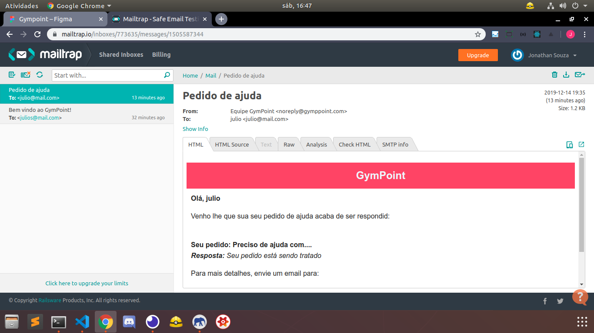

<h1>API Gym Point<h1>
<h3> This in an api rest to manage a gym<h3>
<h4>here you can register your students, you can help them with their questions, and others..<h4>
 

  
  

 

<h3>Dependencies :</h3>
<ul>
  <li>
    <b>Docker: Running postgreSQL and Redis </b>
  </li>
  <li>
    <b>BeeQueue</b>
  </li>
  <li>
    <b>ExpressJS</b>
  </li>
  <li>
    <b>Nodemailer + Mailtrap </b>
  </li>
  <li>
    <b>Sequelize / Sequelize-cli</b>
  </li>
  <li>
    <b>Bcrypt</b>
  </li>
  <li>
    <b>JWT: Json Web Token</b>
  </li>
  <li>
    <b>Yup</b>
  </li>
  <li>
    <b>Date-fns</b>
  </li>
</ul>

