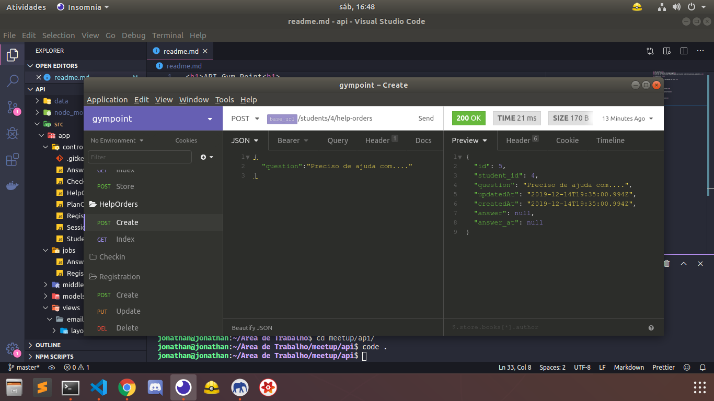
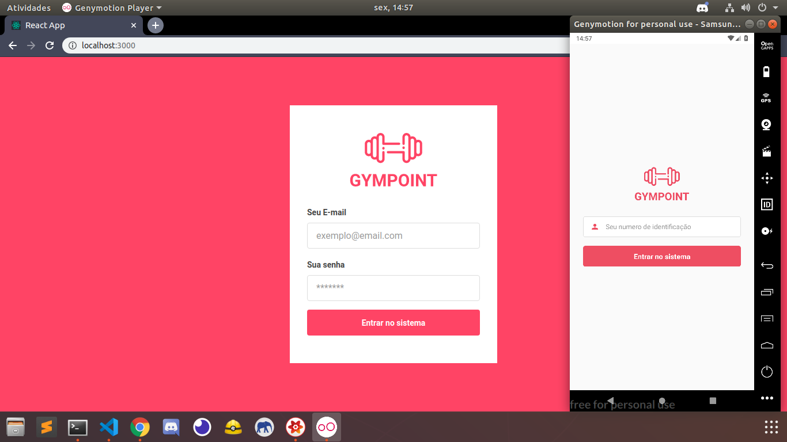
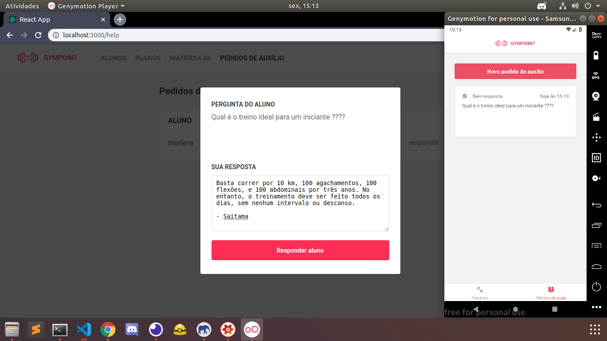

  

<h4>This is a project to manage a Gym<h4>
<i>Instructions:</i>
<ul>
  <li>Inside api's folder run: "docker-compose up", then: "docker-compose start"</li>
  <li>Inside api's folder run:"yarn sequelize db:migrate" then: "yarn sequelize db:seed:all"</li>
  <li>Inside api's folder run: "yarn dev"</li>
   
  <li>Inside web's folder run: "yarn start"</li>
  <li>Inside mobile's folder run: "react-native start"</li>
</ul>

<i>Developer Tools</i>
<ul>
  <li>Back-End: ExpressJS</li>
  <li>Front-End: React</li>
  <li>Mobile: ReactNative</li>
</ul>

  
  
  
  

